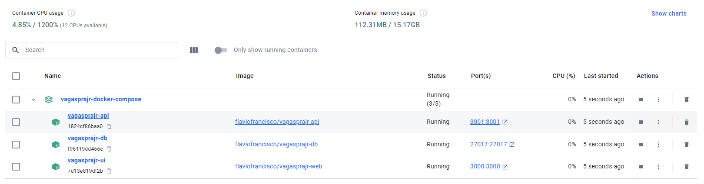

# Welcome to the repository of the project [@vagasprajr](https://x.com/vagasprajr)!

This project was created to help people who are looking for an entry level job in the IT area. The main goal is to provide a list of job opportunities in the IT area in Brazil. The project is open-source and everyone can contribute to it.


## Requirements

- [Docker Desktop](https://www.docker.com/products/docker-desktop/)
- [Node.js](https://nodejs.org/en/download/package-manager)
- Linux Ubuntu 20.04 LTS or Windows with WSL enabled.

## How to run this project using Docker?

### 1. Clone the repository

```bash
git clone https://github.com/flaviofrancisco/vagasprajr-docker-compose.git
```

and follow the instruction in the [README](https://github.com/flaviofrancisco/vagasprajr-docker-compose) file of the repository.

If everything is ok, you should have the following containers in your Docker Desktop:


Running the following containers:

- vagasprajr-api;
- vagasprajr-ui and
- vagasprajr-db

Click on the container `vagasprajr-ui` and access the URL: [http://localhost:3002](http://localhost:3002) to see the project running.

To contribute, you need to Fork this repository and create a Pull Request.

Don't forget to stop the vagasprajr-ui to run the project locally.

## How to run this project locally?

### 1. Clone the repository

```bash
git clone git@github.com:flaviofrancisco/vagasprajr-ui-v2.git
```

Than, access the project folder:

```bash
cd vagasprajr-ui-v2
```

### .env file

Create a `.env` file in the root of the project with the following content:

```bash
NEXT_PUBLIC_API_HOST=https://localhost:3001
```

> You don't need to set up the environment variables: DOCKER_HUB_USERNAME; DOCKER_HUB_REPO; IMAGE_NAME and TAG. These variables are used to deploy the project in the Docker Hub.

### 2. Install the dependencies

```bash
npm install
```

### 3. Run the project

```bash
npm run dev
```

### 4. Access the project

Open your browser and access the following URL: [http://localhost:3002](http://localhost:3002)

### For any question:

Please send an e-mail to: [contato@vagasprajr.com](mailto:contato@vagasprajr.com.br) or
contact us on [X](https://x.com/vagasprajr).

---

**NOTE**

- For now the endpoint to search jobs has not restrictions, but in the future it will be necessary to create an account in the platform to access the data.
- You cannot use this code for commercial purposes without the permission of the project owner.
- The project owner is not responsible for the misuse of the code.

---
